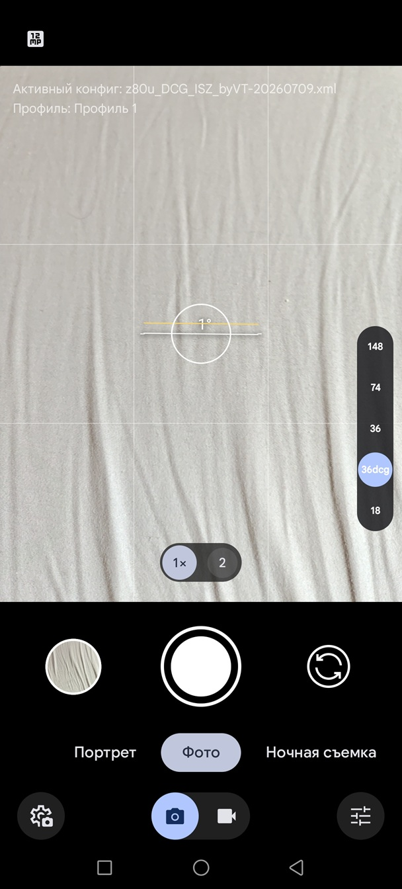
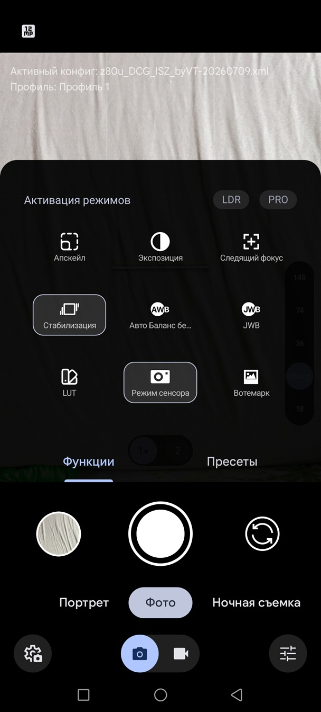
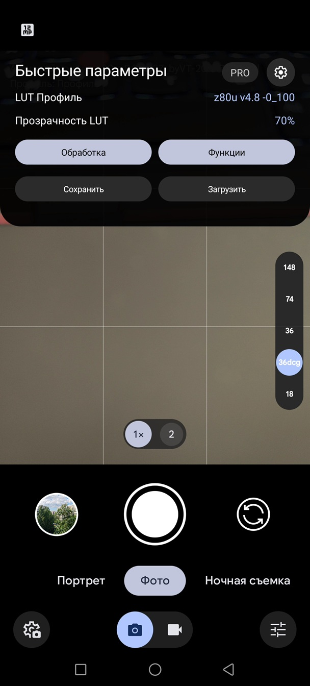

# 📷 Nubia Z80 Ultra — GCam Configs

> Google Camera mod configurations for **ZTE Nubia Z80 Ultra**

---

## 📱 Device Info

| Parameter | Value |
|-----------|-------|
| **Phone** | ZTE Nubia Z80 Ultra |
| **Firmware** | MyOS 16.0.16 — NX741J EEA |

---

## 📸 Camera Sensors

| Camera | Sensor | Size | Features |
|--------|--------|------|----------|
| Main | OmniVision OV50H | 1/1.28" | +DCG |
| Wide | OmniVision OV50E | 1/1.55" | — |
| Tele | OmniVision OV64B | 1/2.0" | +ISZ |

Datasheet: [`OV50H (Light Fusion 900)`](docs/OV50H%20(Light%20Fusion%20900)%20datasheet.pdf)

---

## 🔧 Configs

### LMC GCam

- **APK:** [`LMC9.6 Release 1 Fix2 Samsung.apk`](https://www.celsoazevedo.com/files/android/google-camera/dev-hasli/f/dl22/)
- **Config:** [`LMC/z80u_DCG_ISZ_byVT.xml`](LMC/z80u_DCG_ISZ_byVT.xml)

**Features:**
- Main camera with **DCG** custom vendor option — less noise in shadows, more dynamic range, 14-bit RAW from sensor
- Tele camera with **ISZ** custom vendor option — zoom to 140 mm (sensor crop without binning)
- Custom LUT support with adjustable blend percentage
- HDR+ ZSL (Zero Shutter Lag) mode
- HDR+ Enhanced mode
- Night mode with automatic and manual frame accumulation control
- JWB
- Manually crafted color correction LUTs for each sensor, calibrated against the X-Rite ColorChecker reference
- DCI-P3 JPGs by default

**Video modes:**
- 4K @ 30 fps — HDR HLG + DCG
- 4K @ 60 fps
- OIS in video

**Known issues:**
- No 8K video
- Enabling 60 fps in 4K HDR HLG + DCG mode may cause GCam to crash — reset settings and reapply the config to fix
- GoogleAWB does not work correctly in DCG mode
- EIS in video does not work correctly, disabled by default

**Screenshots:**

---

## 🗄️ Legacy Configs (Unsupported)

> These configs were previously created for other GCam mods and are no longer maintained.

### AGC GCam

- **APK:** `AGC9.6.19_V6.0_snap.apk`
- **Config:** [`AGC/z80u_vt_for4pda_20260615.agc`](AGC/z80u_vt_for4pda_20260615.agc)

---

### MGC GCam

- **APK:** `MGC_9.4.103_V36_MGC.apk`
- **Config:** [`MGC/z80u_vt_for4pda_20260615.xml`](MGC/z80u_vt_for4pda_20260615.xml)

**About this config:**
All rear cameras are tuned for daylight and low-light conditions, balancing sharpness and smoothness — with less emphasis on sharpness than AGC and more smoothing overall.

- Sharpness is slightly lower than the AGC config when comparing pixel-by-pixel, most noticeably on the telephoto lens
- Unlike AGC, some cameras use intentional underexposure with shadow lift in post-processing — better for shooting against bright light, but slightly more shadow noise

---

## 📄 License

See [LICENSE](LICENSE)
